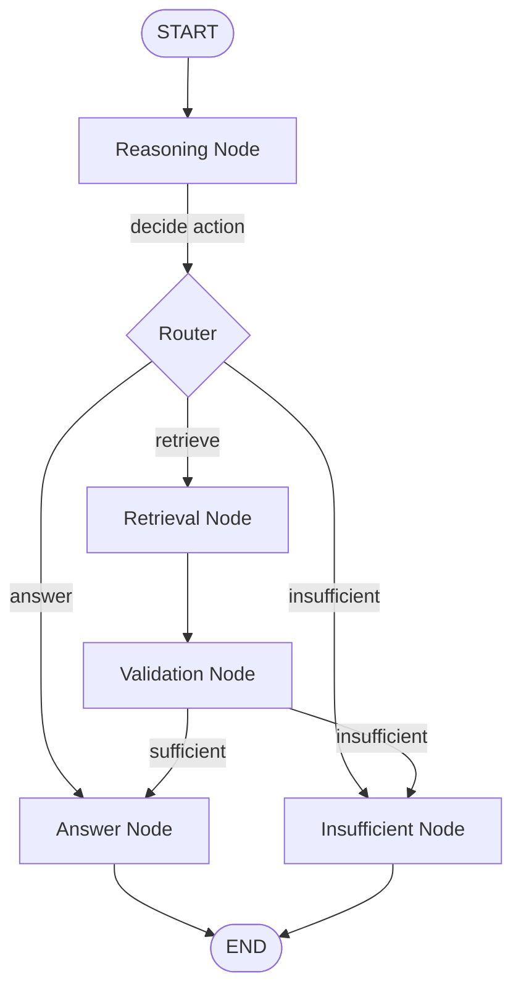

# RAG Agent - Technical Architecture

This document provides a detailed technical overview of the RAG Agent implementation, explaining design decisions, agent patterns, and how components work together.

## 🏛️ Architectural Overview

### Core Principles

1. **Modularity**: Each component has a single responsibility and clean interfaces
2. **Agent-First Design**: LLM actively reasons and makes decisions (not just a pipeline)
3. **Production-Ready**: Proper error handling, logging, and configuration
4. **Local & Zero-Cost**: No external API dependencies

### Technology Stack

| Layer | Technology | Purpose |
|-------|-----------|---------|
| **Orchestration** | LangGraph | Agent state machine and workflow |
| **LLM** | Ollama (llama3.2:3b) | Reasoning, validation, answer generation |
| **Embeddings** | sentence-transformers | Converting text to vectors |
| **Vector DB** | ChromaDB | Storing and searching embeddings |
| **Document Processing** | pypdf, LangChain splitters | PDF parsing and chunking |
| **Interface** | Python CLI | User interaction |

---

## 🧠 Agent Design Pattern

### Why Agent vs Simple RAG Pipeline?

**Traditional RAG (NOT an agent):**
```python
def simple_rag(question):
    docs = retrieve(question)  # Always retrieves
    answer = generate(question, docs)  # Always generates
    return answer
```

**Problems:**
- No decision-making
- Can't handle multi-step queries
- No validation of results
- Fixed execution path

**Agent-Based RAG (Our implementation):**
```python
def agent_rag(question):
    # Agent THINKS and DECIDES
    action = agent.reason(question)
    
    if action == "RETRIEVE":
        docs = agent.retrieve(query)
        if agent.validate(docs, question):
            return agent.answer(question, docs)
        else:
            return agent.insufficient_info()
    elif action == "ANSWER":
        return agent.answer_from_history(question)
    else:
        return agent.insufficient_info()
```

**Benefits:**
- Dynamic reasoning
- Tool calling decisions
- Validation loops
- Multi-step processing

### LangGraph State Machine

LangGraph provides the framework for building stateful agents with complex control flows.

**State Schema:**
```python
class AgentState(TypedDict):
    # Input
    question: str
    session_id: str
    
    # Processing
    messages: List[Dict]  # Chat history
    agent_thought: str    # Reasoning trace
    next_action: str      # Decision: retrieve/answer/insufficient
    
    # Retrieval
    retrieved_docs: List[Dict]
    formatted_context: str
    
    # Validation
    has_sufficient_info: bool
    validation_reason: str
    
    # Output
    final_answer: str
    citations: List[str]
    
    # Control
    iteration_count: int
    should_continue: bool
```

This state flows through all nodes, accumulating information as the agent processes the query.

---

## 📊 Component Architecture

### 1. Document Processing Pipeline

```
PDF File
  ↓
[PDFParser]
  - Extract text page by page
  - Preserve page numbers
  ↓
[DocumentChunker]
  - Split into 512-char chunks
  - 50-char overlap
  - Maintain metadata
  ↓
[EmbeddingGenerator]
  - Generate vectors via sentence-transformers
  ↓
[VectorStore]
  - Store in ChromaDB
  - Index for similarity search
```

**Key Files:**
- `src/processing/pdf_parser.py`: PDF text extraction
- `src/processing/chunker.py`: Text splitting with metadata
- `src/processing/document_manager.py`: Pipeline orchestration

**Design Decisions:**

**Chunk Size (512 characters):**
- Small enough for precise retrieval
- Large enough for context
- Balances embedding quality vs retrieval precision

**Overlap (50 characters):**
- Ensures no information lost at boundaries
- Improves semantic continuity

**Metadata Tracking:**
```python
{
    "source": "report.pdf",
    "page": 5,
    "chunk_index": 2,
    "total_chunks_in_page": 4
}
```
Essential for citations and reference tracking.

### 2. Vector Store & Retrieval

**Architecture:**
```
Query Text
  ↓
[EmbeddingGenerator]
  - Convert to vector
  ↓
[ChromaDB]
  - Similarity search (cosine)
  - Top-K retrieval
  ↓
[Filter by threshold]
  ↓
Retrieved Documents + Metadata
```

**Key Files:**
- `src/retrieval/embeddings.py`: Embedding generation
- `src/retrieval/vector_store.py`: ChromaDB operations
- `src/retrieval/retriever.py`: High-level retrieval interface

**ChromaDB Schema:**
```python
Collection:
  - id: unique identifier
  - embedding: 384-dim vector (sentence-transformers)
  - document: chunk text
  - metadata: {source, page, chunk_index}
```

**Similarity Calculation:**
- ChromaDB returns L2 distance (lower = more similar)
- Converted to similarity score: `similarity = 1 / (1 + distance)`
- Threshold filtering (default: 0.3) removes low-quality matches

### 3. LLM Integration (Ollama)

**Why Ollama?**
- Fully local (no API costs)
- Easy model management
- Good performance with llama3.2
- Compatible with OpenAI-style APIs

**Client Design:**
```python
class OllamaClient:
    def generate(prompt, system_prompt):
        # Single-turn generation
        
    def chat(messages):
        # Multi-turn conversation
        
    def is_available():
        # Health check
```

**Key Files:**
- `src/llm/ollama_client.py`: Ollama API wrapper

**Configuration:**
- **Model**: llama3.2:3b (good balance of speed/quality)
- **Temperature**: 0.1 (low for consistent reasoning)
- **Timeout**: 120s (generous for complex reasoning)

### 4. Agent Orchestration (LangGraph)

This is the heart of the system.

**Graph Structure:**



**Node Functions:**

**1. Reasoning Node** (`reasoning_node`)
```python
Purpose: Analyze question and decide next action
Input: Question + Chat History
Process:
  1. Format context with chat history
  2. Generate reasoning prompt
  3. Call LLM to think
  4. Parse decision (RETRIEVE/ANSWER/INSUFFICIENT)
Output: next_action, retrieval_query
```

**2. Retrieval Node** (`retrieval_node`)
```python
Purpose: Execute document retrieval
Input: retrieval_query
Process:
  1. Generate query embedding
  2. Search vector DB
  3. Format results with metadata
  4. Extract citations
Output: retrieved_docs, formatted_context, citations
```

**3. Validation Node** (`validation_node`)
```python
Purpose: Check if docs contain sufficient info (GUARDRAIL)
Input: Question + Retrieved Context
Process:
  1. Generate validation prompt
  2. Ask LLM: "Can you answer with this context?"
  3. Parse response (YES/NO + reason)
Output: has_sufficient_info, validation_reason
```

**4. Answer Node** (`answer_node`)
```python
Purpose: Generate final answer with citations
Input: Question + Context (or Chat History)
Process:
  1. Choose prompt (doc-based vs history-based)
  2. Generate answer with strict instructions
  3. Update conversation messages
Output: final_answer, updated messages
```

**5. Insufficient Info Node** (`insufficient_info_node`)
```python
Purpose: Handle "cannot answer" cases
Input: Question + Reason
Process:
  1. Generate polite explanation
  2. Suggest what documents might be needed
Output: final_answer explaining limitation
```

**Key Files:**
- `src/agent/state.py`: State schema definition
- `src/agent/nodes.py`: All node implementations
- `src/agent/prompts.py`: Prompt templates
- `src/agent/graph.py`: Graph construction & orchestration

**Routing Logic:**

**After Reasoning:**
```python
def should_continue(state):
    action = state["next_action"]
    if action == "retrieve":
        return "retrieval"
    elif action == "answer":
        return "answer"
    else:
        return "insufficient"
```

**After Validation:**
```python
def should_answer_or_retry(state):
    if state["has_sufficient_info"]:
        return "answer"
    else:
        return "insufficient"
```

---

## 🛡️ Guardrails Implementation

Multi-layered approach to ensure answer quality and safety.

### Layer 1: System Prompt Guardrail
```python
SYSTEM_PROMPT = """
CORE PRINCIPLES:
1. ONLY use information from the provided documents
2. NEVER make up, infer, or hallucinate information
3. If information is not in the documents, clearly state this
4. Always cite your sources
"""
```

### Layer 2: Reasoning Guardrail
Agent decides if question is even answerable:
- Out of scope → "insufficient"
- Needs documents → "retrieve"
- Can use history → "answer"

### Layer 3: Validation Guardrail (Code + LLM)
```python
def validation_node(state):
    # Check if documents retrieved
    if not state["retrieved_docs"]:
        return {"has_sufficient_info": False}
    
    # Ask LLM to validate
    prompt = "Can you answer this question with this context?"
    response = llm(prompt)
    
    # Parse and return
    return {"has_sufficient_info": "YES" in response}
```

### Layer 4: Answer Guardrail
Strict prompt instructions in `ANSWER_PROMPT`:
```python
"""
STRICT RULES:
1. Use ONLY information from the context above
2. Do NOT add information not present in the context
3. ALWAYS cite sources: [Source: filename.pdf, Page X]
"""
```

### Layer 5: Citation Requirement
Every answer must include citations from metadata:
```python
citations = [
    f"[Source: {doc['metadata']['source']}, Page {doc['metadata']['page']}]"
    for doc in retrieved_docs
]
```

---

## 💾 Memory & State Management

### Conversation Memory

**Implementation:**
```python
state["messages"] = [
    {"role": "user", "content": "What is revenue?"},
    {"role": "assistant", "content": "$100M [Source: report.pdf, Page 3]"},
    {"role": "user", "content": "And profit?"},
    {"role": "assistant", "content": "$20M [Source: report.pdf, Page 5]"}
]
```

**Usage in Follow-ups:**
```python
def reasoning_node(state):
    # Format last 4 messages for context
    chat_history = "\n".join([
        f"{msg['role']}: {msg['content']}"
        for msg in state["messages"][-4:]
    ])
    
    # Agent can now understand "And profit?" refers to previous context
```

### Session Isolation

Currently: In-memory per CLI session
- Each run creates new session
- No persistence between runs

**Future Enhancement:**
```python
# Use LangGraph's checkpointer for persistence
from langgraph.checkpoint.sqlite import SqliteSaver
memory = SqliteSaver.from_conn_string("sessions.db")
app = graph.compile(checkpointer=memory)
```

---

## 📈 Performance Considerations

### Optimization Points

**1. Embedding Generation**
- Cached by sentence-transformers
- Batch processing (32 at a time)
- ~100ms per query embedding

**2. Vector Search**
- ChromaDB uses HNSW index (fast approximate search)
- O(log n) complexity
- ~50ms for 1000 chunks

**3. LLM Inference**
- llama3.2:3b is fast (~1-2 tokens/s on CPU)
- Consider GPU for 10x speedup
- Alternative: llama3.2:1b for even faster responses

**4. Chunking Strategy**
- Chunk size affects:
  - Smaller → More precise, but more LLM calls
  - Larger → More context, but less precise retrieval
- 512 chars is a good balance

### Resource Usage

**Memory:**
- Embedding model: ~100MB
- LLM model: ~2GB (llama3.2:3b)
- Vector DB: ~1KB per chunk
- Total: ~2.5-3GB for typical use

**Disk:**
- ChromaDB storage: ~500KB per 1000 chunks
- Uploaded PDFs: Depends on documents
- Models: ~2.2GB (embedding + LLM)

---

## 🔄 Data Flow Example

**Scenario: User asks "What is Q1 revenue?" after uploading financial_report.pdf**

### Step 1: Document Upload (One-time)
```
User uploads PDF
  ↓
PDFParser extracts: "Q1 revenue was $150M..." (page 3)
  ↓
Chunker splits: ["Q1 revenue was $150M...", ...]
  ↓
EmbeddingGenerator creates vector for each chunk
  ↓
VectorStore stores in ChromaDB with metadata
```

### Step 2: Query Processing

```
User: "What is Q1 revenue?"
  ↓
[Reasoning Node]
  State: {question: "What is Q1 revenue?"}
  LLM thinks: "New question, need to retrieve documents"
  Decision: next_action = "retrieve", query = "Q1 revenue"
  ↓
[Retrieval Node]
  Generate embedding for "Q1 revenue"
  Search ChromaDB → Top 5 similar chunks
  Retrieved: [
    {
      "content": "Q1 revenue was $150M, up 20%...",
      "metadata": {"source": "financial_report.pdf", "page": 3}
    },
    ...
  ]
  ↓
[Validation Node]
  LLM checks: "Can I answer 'What is Q1 revenue?' with this context?"
  Response: "SUFFICIENT: YES, context contains Q1 revenue info"
  Decision: has_sufficient_info = True
  ↓
[Answer Node]
  Generate answer with citations:
  "Q1 revenue was $150 million, representing a 20% increase..."
  "[Source: financial_report.pdf, Page 3]"
  ↓
Return to user
```

### Step 3: Follow-up Query

```
User: "And Q2?"
  ↓
[Reasoning Node]
  State: {
    question: "And Q2?",
    messages: [previous conversation]
  }
  LLM thinks: "Follow-up question, need context from docs"
  Decision: next_action = "retrieve", query = "Q2 revenue"
  ↓
[Similar retrieval process...]
  ↓
Answer: "Q2 revenue was $165M [Source: financial_report.pdf, Page 5]"
```

---

## 🧪 Testing Strategy

### Unit Tests (Recommended)
```python
# Test document processing
def test_pdf_parser():
    parser = PDFParser()
    pages = parser.extract_text("sample.pdf")
    assert len(pages) > 0
    assert "source" in pages[0]

# Test chunking
def test_chunker():
    chunker = DocumentChunker()
    chunks = chunker.chunk_text("long text...")
    assert all("metadata" in c for c in chunks)

# Test retrieval
def test_retrieval():
    retriever = DocumentRetriever()
    results = retriever.retrieve("test query")
    assert isinstance(results, list)
```

### Integration Tests
```python
# Test full pipeline
def test_upload_and_query():
    cli = RAGAgentCLI()
    cli.upload_document("test.pdf")
    answer = cli.ask_question("What is this about?")
    assert "[Source:" in answer
```

### Manual Testing Checklist
- [ ] Upload various PDF types (text, scanned, tables)
- [ ] Ask questions with known answers
- [ ] Ask questions with no answers (test guardrails)
- [ ] Test follow-up questions
- [ ] Test edge cases (empty PDFs, corrupted files)

---

## 🚀 Deployment Considerations

### Local Development
Current implementation is perfect for:
- Development & testing
- Assignments & demos
- Single-user scenarios
- Sensitive documents (stays local)

### Production Enhancements

**1. Persistence:**
```python
# Add session persistence
from langgraph.checkpoint.sqlite import SqliteSaver
checkpointer = SqliteSaver.from_conn_string("checkpoints.db")
app = graph.compile(checkpointer=checkpointer)
```

**2. Concurrency:**
```python
# Use FastAPI for web API
from fastapi import FastAPI
app = FastAPI()

@app.post("/upload")
async def upload(file: UploadFile):
    # Handle concurrent uploads
    
@app.post("/query")
async def query(question: str):
    # Handle concurrent queries
```

**3. Scalability:**
- Replace ChromaDB with production vector DB (Pinecone, Weaviate)
- Use GPU for faster LLM inference
- Add caching layer for common queries
- Implement rate limiting

**4. Monitoring:**
```python
# Add metrics
from prometheus_client import Counter, Histogram

query_counter = Counter('queries_total', 'Total queries')
latency_histogram = Histogram('query_latency', 'Query latency')
```

---

## 🎯 Assignment Coverage

### Requirements Checklist

✅ **Agent Design & Orchestration**
- LangGraph state machine
- Multi-node reasoning workflow
- Dynamic decision-making

✅ **RAG Implementation**
- Vector search with ChromaDB
- Semantic embeddings
- Context-aware retrieval

✅ **Memory**
- Conversation history in state
- Context for follow-ups
- Session management

✅ **Tool Calling**
- Retrieval tool with agent decision
- LLM decides when to use tools
- Not just automatic retrieval

✅ **Guardrails**
- Multi-layer validation
- Strict prompt instructions
- Answer feasibility checks
- Citation requirements

✅ **Real-world Integration**
- File system (PDF uploads)
- Vector database (ChromaDB)
- Local LLM (Ollama)

✅ **Advanced Tech**
- LangGraph (modern agent framework)
- State-based orchestration
- Validation loops
- Citation tracking

---

## 📚 Further Reading

- **LangGraph Docs**: https://langchain-ai.github.io/langgraph/
- **Ollama**: https://ollama.ai/
- **ChromaDB**: https://docs.trychroma.com/
- **sentence-transformers**: https://www.sbert.net/

## 🤝 Contributing

This is a reference implementation. Feel free to:
- Add new features
- Improve prompts
- Optimize performance
- Add tests
- Create Streamlit UI

---

**Questions?** The code is heavily documented with inline comments explaining the "why" behind each design decision.
